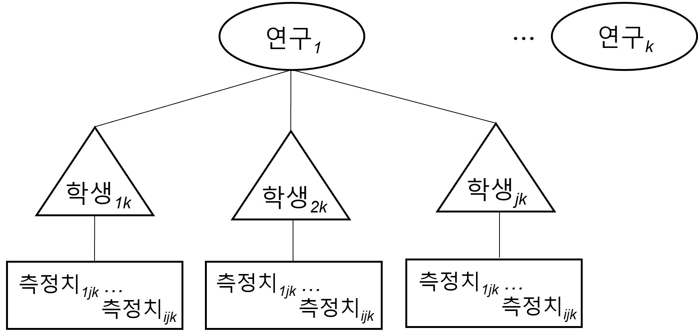
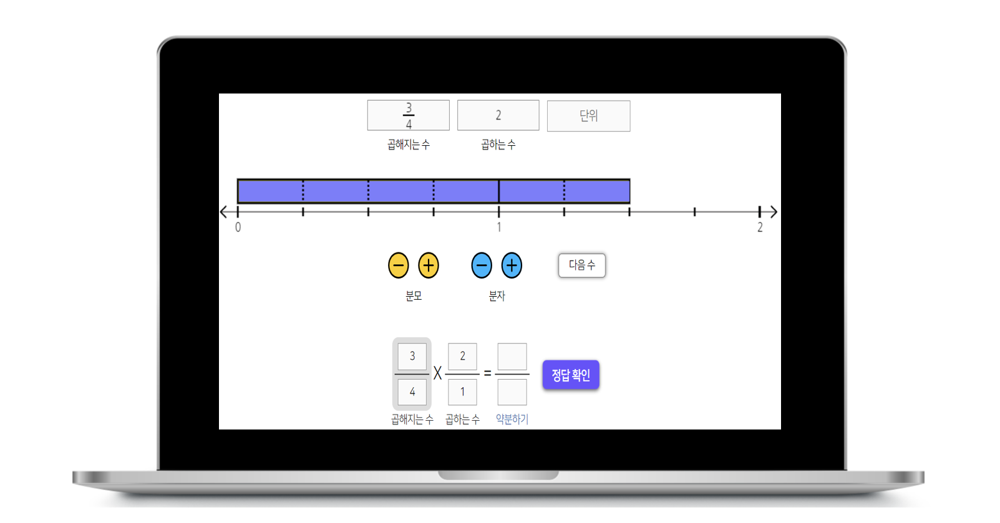
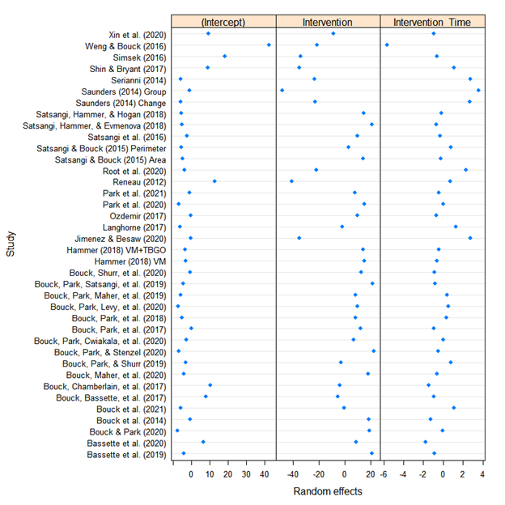

```{r setup, include=FALSE}
options(htmltools.dir.version = FALSE)

library(xaringanthemer)
style_duo_accent(
  primary_color = "#450012",
  secondary_color = "#eeeeee",
  inverse_header_color = "#FFFFFF",
  base_font_size = "20px",                                
  code_font_size = "0.75rem",                             
  header_font_google = google_font("sans serif"),   
  text_font_google = google_font("Roboto"),
  extra_css = list(
      ".small" = list("font-size" = "1.5rem"),                  # for smaller text when needed
      ".big"  = list("font-size" = "3rem"),                   # for bigger text when needed  
      ".small-code pre code" = list("font-size" = ".72rem"),    # small code
      ".tiny-code pre code" = list("font-size" = ".6rem"),      # tiny code
      "li" = list("padding" = "2px 0px 0px"),                   # more list padding
      "table th, table td" = list("padding" = "4px")            # table cell padding
  )
)

```

### 목차

* **단일대상 다층메타분석**의 필요성

* 장애학생을 위한 **가상조작물을 활용한 수학 중재**의 필요성 

* 단일대상 다층메타분석 **연구 방법과 적용 실제**   

* **논의** 및 **제한점**

.footnote[본 자료는 온라인에서 다운로드 가능합니다. https://github.com/mshin77/ksse_ld.git]

---

### 단일대상 다층메타분석의 필요성

- 단일대상 연구
    - 대상자의 문제행동을 감소시키거나 바람직한 행동을 증진
    - 개별(혹은 소집단)로 중재를 계획하고 실행함
    - 연구설계를 통하여 체계적으로 실험 통제(내적 타당도)를 확인   

- 다층(메타)분석
    - 대상자별로 시간에 따른 행동 변화를 반복측정 
    - 종단자료 분석을 통한 다층모형 분석 
    - 위계적 다층자료 모형 설정 (메타분석)

---

### .center[위계적 다층자료 구조]
- 1수준(반복 측정 자료) 2수준(학생 수준), 3수준(연구 수준)

.center[]

---

### 장애학생을 위한 가상조작물을 활용한 수학 중재의 필요성 

.pull-left[
예시: [재미난 분수](http://funfraction.net) http://funfraction.net
  
]
.pull-right[

 가상조작물은 ...

- 웹 등의 환경에서 작동되는 __역동적__인 시각적 모형 

- 수학 교수 및 학습에 활용되는 __구조적__인 도식

- 다양한 형태로 확장, 변환, 선택하여 사용 가능

- 개념적인 수학 학습에 활용 

- __상호작용__적이고 다양한 수학 학습 기회 제공  

]

---

### 단일대상 다층메타분석 연구 방법과 적용 실제
- [Shin 외(2021)](https://journals.sagepub.com/doi/abs/10.1177/00144029211007150)의 데이터를 재분석하여 예시로 활용함

- 온라인 공개 데이터 https://doi.org/10.17605/OSF.IO/WVTXG

- 연구 목적: 
  - 단일대상 다층메타분석을 활용하여 장애학생을 위한 가상조작물을 활용한 수학 중재의 중재 및 조절 효과 분석

- 연구 질문: 
  - 장애학생을 위한 가상조작물을 활용한 수학 중재는 어떠한 즉각적인 평균 효과크기 및 변화 추이를 보이는가?
  - 가상조작물을 활용한 수학 중재의 즉각적인 평균 효과크기는 학생 및 연구 관련 특성에 따라 어떻게 다른가?
  - 가상조작물을 활용한 수학 중재의 변화 추이는 학생 및 연구 관련 특성에 따라 어떻게 다른가? 

---

### .center[연구 방법] 

- 연구의 포함 기준: 
  - 2000년부터 2020년까지 영어로 발표된 학위논문 및 학술지 논문
  - 유치원, 초등학교, 중학교, 고등학교 장애학생을 대상으로한 연구
  - 종속변인: 수학 정확도
  - 독립변인: 가상조작물을 활용한 수학 중재
  - 연구설계: 반전설계(기초선 포함), 대상자간 중다 기초선/중다간헐 설계, 기준변경 설계  

- 자료 탐색: 온라인 [추가 자료 그림 1](https://journals.sagepub.com/doi/suppl/10.1177/00144029211007150) 참고: **총 35편 연구** 포함됨 
- 자료 코딩: 
  - 단일대상 데이터 추출:  GetData Graph Digitizer (GetData Graph Digitizer,
2013) 웹 어플리케이션 활용 
  - 학생 관련 변인 코딩: 성별, 학년, 장애유형   
  - 연구 관련 변인 코딩: 사전훈련 목적, 교수 방법, 개발자, 기기, 가상조작물 유형, 도식 모형
  - 연구에 대한 질적 평가: Council for Exceptional Children (2014)

---
### .center[본 연구에서 활용된 위계적 다층 자료 구조]
- 데이터 보기: https://osf.io/s6qx4/?show=view

```{r, echo=FALSE}
# Import the data set from the working directory. ----
library(readr)
library(dplyr)
library(kableExtra)
data <- read_csv("../data/data.csv", show_col_types = FALSE)
VM_sample_td <- data %>% kbl(align = "c") %>% 
  kable_styling(
    bootstrap_options = c("striped","hover","condensed"),
    full_width = F,
    font_size = 16,
    fixed_thead = T
  ) %>% 
  scroll_box(
    height = "400px"
  )
VM_sample_td
```

---

### .center[그래프 데이터 보기]

.pull-left[
```{r, echo=FALSE}
Intervention_0 <- data %>%
  dplyr::filter(Intervention== 0) %>%
  dplyr::group_by(Case) %>%
  dplyr::mutate(max_session_on_group_by = max(Session))

Phase <- ifelse(as.character(data$Intervention)==0,"Baseline","Intervention")

sced.plot <- ggplot2::ggplot(data, ggplot2::aes(Session, Outcome, color = Phase)) +
  ggplot2::geom_line() +
  ggplot2::geom_point() +
  ggplot2::facet_wrap(~Case, ncol = 1) +
  ggplot2::geom_vline(data = Intervention_0, ggplot2::aes(xintercept = Intervention_0$max_session_on_group_by + 0.5),
                      linetype = "dashed") +
  ggplot2::theme_bw()

sced.plot <- sced.plot %>% plotly::ggplotly()
sced.plot
```
]

.pull-right[

살펴보기
- 비연속적 변화 모형

- 기초선에서의 절편과 기울기

- 중재 첫번째 회기에서의 즉각적인 효과 

- 중재 구간 내 기울기 변화  
]

---

### .center[연구 결과 모형 1]

- 고정 효과

.small-code.pull-left[
```{r, eval=FALSE}
lme(Outcome ~ 1 + Intervention + Intervention_Time, 
    random  = ~ 1 + Intervention + Intervention_Time | 
      Study/Case, data = VM, 
    correlation = corAR1(form = ~ 1 | 
                           Study/Case/Intervention), 
    weights = varIdent(form = ~ 1 | Intervention), 
    method = "REML", 
    na.action = "na.omit",
    control = list(opt = "optim")
)
```
]
.center[]

---
- 램덤 효과
.center[]

---
### .center[연구 결과 모형 2, 모형 3]
.center[]

---
### 논의 및 제한점
- 가상조작물을 활용한 수학 중재는 통계적으로 유의한 즉각적인 중재 효과 및 긍정적인 변화 추이를 나타냈음.

- 즉각적 중재 효과 크기는 학생의 학년, 장애 유형, 개발자, 기기, 가상조작물 유형에 따라 다양한 조절 효과를 보였음.

- 학생 및 연구 관련 변인은 중재 기간 중의 수학 성적(정확성) 변화 추이에 큰 영향을 미치지 않았음.

- 본 연구에서는 단일대상 연구에서 중요하게 여겨지는 시각적인 분석이 이루어지지 않았음.

- 단일대상 연구설계 유형(예: 반전설계, 대상자간 중다 기초선/중다간헐 설계 )에 따른 차별적인 분석이 고려되지 않았음 

---

### 본 연구의 시사점

- 가상조작물을 활용한 수학 중재는 교육 현장에서 다양한 형태로 활용 가능함 

- 단일대상 연구 설계의 데이터 구조를 기반으로 지속적인 검증이 이루어져야 함  

- 오픈사이언스를 기반으로한 투명한 연구 과정을 특수교육 분야에 적용

- 후속 연구자들이 반복검증할 수 있도록 공공 자료 마련 및 실천 


