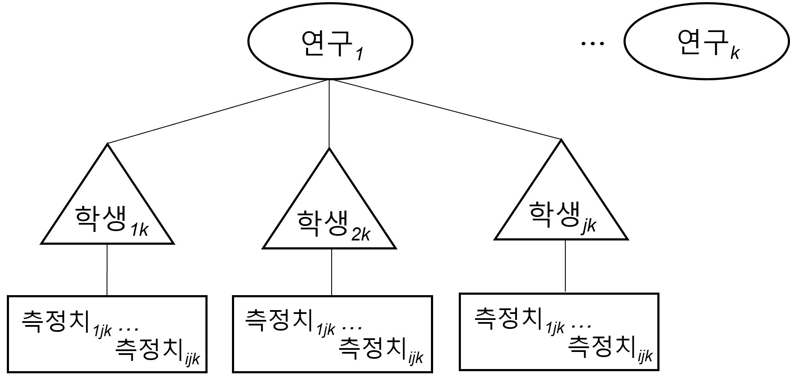

```{r setup, include=FALSE}
options(htmltools.dir.version = FALSE)

library(xaringanthemer)
style_duo_accent(
  primary_color = "#450012",
  secondary_color = "#eeeeee",
  inverse_header_color = "#FFFFFF",
  base_font_size = "20px",                                
  code_font_size = "0.75rem",                             
  header_font_google = google_font("sans serif"),   
  text_font_google = google_font("Roboto"),
  extra_css = list(
      ".small" = list("font-size" = "1.5rem"),                  # for smaller text when needed
      ".big"  = list("font-size" = "3rem"),                   # for bigger text when needed  
      ".small-code pre code" = list("font-size" = ".72rem"),    # small code
      ".tiny-code pre code" = list("font-size" = ".6rem"),      # tiny code
      "li" = list("padding" = "2px 0px 0px"),                   # more list padding
      "table th, table td" = list("padding" = "4px")            # table cell padding
  )
)

```

### 목차

* **단일대상 다층메타분석**의 필요성

* 장애학생을 위한 **가상조작물을 활용한 수학 중재**의 필요성 

* 단일대상 다층메타분석 **연구 방법과 적용 실제**   

* **논의** 및 **미래연구를 위한 제언**

.footnote[본 자료는 https://github.com/mshin77/ksse_ld에서 다운로드 가능합니다.]

---

### 단일대상 다층메타분석의 필요성

- 단일대상 연구
    - 대상자의 문제행동을 감소시키거나 바람직한 행동을 증진
    - 개별(혹은 소집단)로 중재를 계획하고 실행함
    - 연구설계를 통하여 체계적으로 실험 통제(내적 타당도)를 확인   

- 다층(메타)분석
    - 대상자별로 시간에 따른 행동 변화를 반복측정 
    - 종단자료 분석을 통한 다층모형 분석 
    - 위계적 다층자료 모형 설정 (메타분석)

---

### .center[위계적 다층자료 구조]

.center[]

---

### 장애학생을 위한 가상조작물을 활용한 수학 중재의 필요성 

.pull-left[
예시: [재미난 분수](http://funfraction.net) http://funfraction.net
  
]
.pull-right[

 가상조작물은 ...

- 웹 등의 환경에서 작동되는 __역동적__인 시각적 모형 

- 수학 교수 및 학습에 활용되는 __구조적__인 도식

- 다양한 형태로 확장, 변환, 선택하여 사용 가능

- 개념적인 수학 학습에 활용 

- __상호작용__적이고 다양한 수학 학습 기회 제공  

]

---

### 단일대상 다층메타분석 연구 방법과 적용 실제
- [Shin 외(2021)](https://journals.sagepub.com/doi/abs/10.1177/00144029211007150)의 데이터를 재분석하여 예시로 활용함

- 온라인 공개 데이터 https://doi.org/10.17605/OSF.IO/WVTXG

- 연구 목적: 
  - 단일대상 다층메타분석을 활용하여 장애학생을 위한 가상조작물을 활용한 수학 중재의 중재 및 조절 효과 분석

- 연구 질문: 
  - 장애학생을 위한 가상조작물을 활용한 수학 중재는 어떠한 즉시적인 평균 효과크기 및 변화 추이를 보이는가?
  - 가상조작물을 활용한 수학 중재의 즉시적인 평균 효과크기는 학생 및 연구 관련 특성에 따라 어떻게 다른가?
  - 가상조작물을 활용한 수학 중재의 변화 추이는 학생 및 연구 관련 특성에 따라 어떻게 다른가? 

---

### .center[연구 방법] 

- 연구의 포함 기준: 
  - 2000년부터 2020년까지 영어로 발표된 학위논문 및 학술지 논문
  - 유치원, 초등학교, 중학교, 고등학교 장애학생을 대상으로한 연구
  - 종속변인: 수학 정확도
  - 독립변인: 가상조작물을 활용한 수학 중재
  - 연구설계: 반전설계(기초선 포함), 대상자간 중다 기초선/중다간헐 설계, 기준변경 설계  

- 자료 탐색: 온라인 [추가 자료 그림 1](https://journals.sagepub.com/doi/suppl/10.1177/00144029211007150) 참고: **총 35편 연구** 포함됨 

- 자료 코딩: 
  - 단일대상 데이터 추출:  GetData Graph Digitizer (GetData Graph Digitizer,
2013) 웹 어플리케이션 활용 
  - 학생 관련 변인 코딩: 성별, 학년, 장애명   
  - 연구 관련 변인 코딩: 사전훈련 목적, 교수 방법, 개발자, 기기, 가상조작물 유형, 도식 모형
  - 연구에 대한 질적 평가: 

---

### .center[분석을 위한 R 패키지 설치 및 불러오기]

.pull-left[
```{r needed-packages, eval=FALSE}
# R 패키지 설치하기
install.packages("readxl")
install.packages("nlme")
install.packages("msm")
install.packages("lattice")
install.packages("metafor")
```
]

.pull-right[
```{r, eval=FALSE}
# R 패키지 불러오기
library(readxl)
library(nlme)
library(msm)
library(lattice)
library(metafor)
```
]

```{r, eval=FALSE}
# Import the data set from the working directory. ----
urlfile="https://github.com/mshin77/ksse_ld/blob/master/data/VM.csv"
    VM <- readr::read_csv(url(urlfile))
VM # Display data.
```

---

### .center[본 연구에서 활용된 위계적 다층 자료 구조]


---
class: center, middle
Also note the very cool [**matching ggplot themes**](https://pkg.garrickadenbuie.com/xaringanthemer/index.html#matching-ggplot-themes)


---

# Styling with Apron & Descartes

_avoiding "raw" HTML_

- [Apron and Descartes documentation](https://story.xaprb.com/slides/adirondack/#1)
    - [Slide layouts (**Apron**)](https://story.xaprb.com/slides/adirondack/#5)
    - [Image & element position / colors (**Descartes**)](https://story.xaprb.com/slides/adirondack/#33)
        - [descartes.less](https://github.com/xaprb/story/blob/master/static/css/descartes.less)

    
### AND

- **Tachyons** -- classes to control formatting and CSS 
    - [See XaringanExtra # tachyons](https://pkg.garrickadenbuie.com/xaringanExtra/#/tachyons)


--

In these cases you must be comfortable importing the appropriate CSS sheets and referencing them in the YAML header.  Not hard, but beyond the focus of this workshop.

- [apron.css](https://github.com/xaprb/story/blob/master/static/css/apron.css)
- [descartes.css](https://github.com/xaprb/story/blob/master/static/css/descartes.css)
- [tachyons.min.css](https://raw.githubusercontent.com/xaprb/story/master/static/css/tachyons.min.css)


